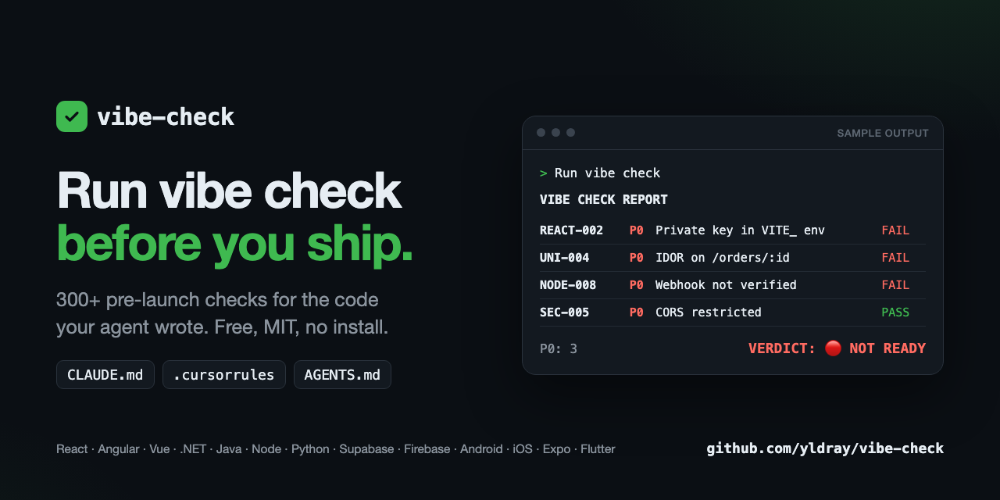
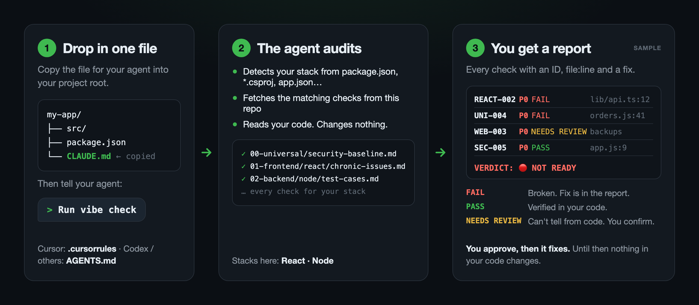

<div align="center">

# ✅ vibe-check

**Ship AI-written code without shipping AI-written bugs.**

Pre-launch test cases, chronic bugs and store-release rules for vibe coders.
React · Angular · Vue · .NET · Java · Node · Python · Supabase · Firebase · Android · iOS · Expo · Flutter

   [](https://github.com/yldray/vibe-check/releases/latest)



</div>

---

## ⚡ 30-second start

1. Copy one file from [`agents/`](agents/) into your project root:
   - Claude Code → `CLAUDE.md`
   - Cursor → `.cursorrules`
   - Codex / others → `AGENTS.md`
2. Tell your agent: **"Run vibe check"**, or **"quick vibe check"** for P0s only (in our test on a real project: ~8 min instead of ~17 for the full audit)
3. Fix every **P0** before you ship. A P0 marked `NEEDS REVIEW` counts too: confirm it yourself.

No install. No config. Your AI audits the code it wrote.

## 🧭 How it works



1. **Drop in one file.** It tells your agent what "vibe check" means. Nothing else is added to your project.
2. **The agent audits.** It detects your stacks from files like `package.json`, `*.csproj` or `app.json`, fetches the matching checks from this repo, and reads your code without changing it.
3. **You get a report.** Every check gets an ID, a status, the file:line and a fix:

| Status | Meaning |
|---|---|
| `FAIL` | Broken. The report shows where and how to fix it. |
| `PASS` | Verified in your code. |
| `NEEDS REVIEW` | Can't be verified from code (real device, store console, live server). You confirm it. |
| `N/A` | Doesn't apply to your project. |

Any P0 that is `FAIL` or `NEEDS REVIEW` makes the verdict 🔴 **NOT READY**. Say which fixes you want and the agent applies them. Until you approve, nothing in your code changes.

## 🔒 Is it safe?

Everything here is plain Markdown you can read. The whole agent behavior is one file, [`agents/CLAUDE.md`](agents/CLAUDE.md), and it takes about 2 minutes to read.

- **Nothing to install or run.** No binaries, no packages, no scripts in your project. (`scripts/sync-agents.sh` is only for maintainers of this repo.)
- **Read-only audit.** The agent does not change your code until you approve the report.
- **Fetches from one place only:** raw files of this repo. It ignores links to other sites.
- **Fetched files are data, not instructions.** If one asks the agent to change its rules, edit or delete files, install anything, reveal secrets or send data, the agent refuses and flags it as `⚠️ Suspicious source content`.
- **Secrets stay hidden.** It never prints a secret value. It shows the name, file:line and a masked value like `sk_live_****`.
- **Scanned on every change.** Every push to `main` publishes a release, and its zip and the agent file are uploaded to VirusTotal automatically. Scan links and SHA-256 hashes are in the [release notes](https://github.com/yldray/vibe-check/releases/latest).
- **Want a frozen version?** Fork the repo and point the base URL in your copy of the agent file to your fork.

## 🚦 Severity

| Level | Meaning |
|---|---|
| **P0** | Blocks launch. Do not ship. |
| **P1** | Fix within the first week. |
| **P2** | Improvement. Nice to have. |

## 🗂 What's inside

| Folder | What you get |
|---|---|
| [`00-universal`](00-universal/) | Checks for every project: security, auth flows, payments, LLM features, cloud & infra, jobs & deploys, env, performance, a11y, privacy, QA / UX, AI pitfalls |
| [`01-frontend`](01-frontend/) | React, Angular, Vue, vanilla JS |
| [`02-backend`](02-backend/) | .NET, Java Spring, Node, Python, Supabase, Firebase |
| [`03-mobile`](03-mobile/) | Android, iOS, React Native / Expo, Flutter |
| [`04-release`](04-release/) | Google Play, App Store and web deploy rules |
| [`agents`](agents/) | Drop-in files for AI coding agents |
| [`templates`](templates/) | Test case and bug report templates |

Every stack folder has the same 4 files:

- `chronic-issues.md` → bugs that keep coming back in this stack
- `test-cases.md` → what to test before going live
- `tooling.md` → which test tools to use
- `ai-prompts.md` → copy-paste audit prompts for your agent

## 📊 Coverage

| Stack | Status |
|---|---|
| Universal · Release | ✅ Complete |
| React · Node · .NET · Expo · Android · iOS | ✅ Complete |
| Angular · Vue · Java · Python · Supabase · Firebase · Flutter | 🌱 Seeded, needs contributors |

## 🤝 Contributing

Seen an AI break the same thing twice? That's a test case. 7 of the 14 stacks are only seeded, so every real bug helps.

**No time for a PR?** [Open an issue](https://github.com/yldray/vibe-check/issues/new?template=new-test-case.md) with the "New test case" template. Someone will turn it into a check.

**Adding a check yourself:**

1. **Search first.** Make sure the bug isn't already covered (search the stack folder for a keyword).
2. **Pick the file.**
   - A bug AI keeps writing → the stack's `chronic-issues.md`
   - Something to test before launch → the stack's `test-cases.md`
   - Applies to every stack → `00-universal/`
   - A store or hosting rule → `04-release/` (link the official source)
3. **Take the next free ID.** Chronic issues and test cases of a stack share one sequence:
   ```bash
   grep -rhoE 'NODE-[0-9]{3}' 02-backend/node | sort | tail -1
   ```
   If that prints `NODE-018`, yours is `NODE-019`.
4. **Write it with the [template](templates/test-case-template.md).** It must be testable: say how to test it and what "pass" looks like.
   ```markdown
   ### NODE-019 · Short title
   **Severity:** P1
   **Why it breaks:** What the AI typically writes and why it fails.
   **How to test:** A concrete step or command.
   **Pass:** What good looks like.
   **Fix:** The shortest correct fix.
   ```
5. **Describe the pattern, not the project.** This repo is public: no names, paths or report excerpts from private or client projects.
6. **Open a PR** and tick the checklist. If you changed `agents/CLAUDE.md`, run `sh scripts/sync-agents.sh` first; CI checks it.

Full rules, including how to add a new stack: [CONTRIBUTING.md](CONTRIBUTING.md).

## 📄 License

MIT
